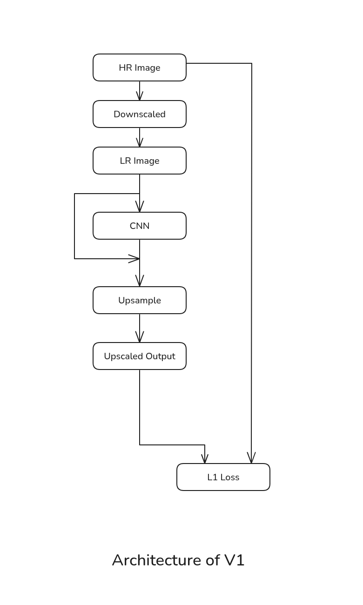
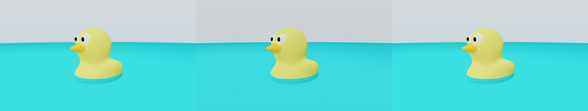
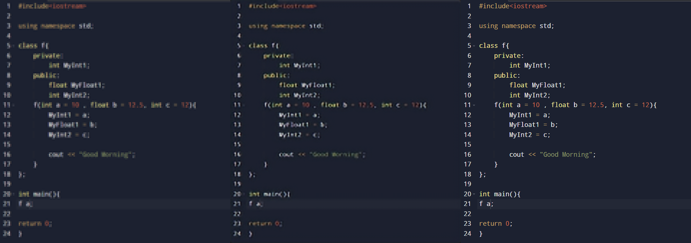
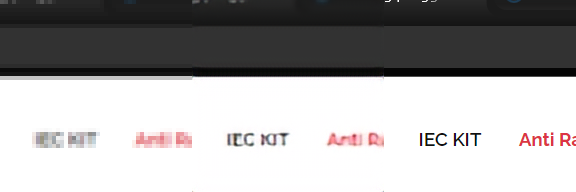

# Upscaler

A simple 4× image super-resolution model, trained from scratch on screenshots.
Small CNN + sub-pixel upsampling, pixel-L1 loss, self-generated (LR, HR) pairs.

Built as a learning project (works only on screenshots as I didn't use real camera images in the dataset)
## Architecture



- HR patches are cropped from disk and passed through a randomised **degradation
  pipeline** (Gaussian blur + downsample + noise) to produce matching LR patches.
- The **CNN body** (head conv → residual blocks → tail conv) operates entirely
  in low-resolution space.
- The original **LR is carried around the CNN** and concatenated with the
  learned features (the "skip" arrow in the diagram) before upsampling. This
  lets the network focus on learning *corrections*, not the identity mapping.
- **Sub-pixel convolution** (`PixelShuffle`) does the actual upscaling in
  stages of 2×.
- Loss is **L1(SR, HR)**. Perceptual / embedding loss is the planned next step.

## Results so far

Trained on ~2k screenshots at 4× upscaling, pixel-L1 loss only.
Each grid is **LR (nearest-upsampled) | SR | HR**.

The larger config (`channels=64`, `num_res_blocks=32`, ~2.7M params) noticeably
outperforms the ~1M-param baseline on both L1 and PSNR — edges are sharper,
text is more legible, less residual noise. Samples below are from that model:





Training-time held-out sample after ~12k steps of the earlier baseline:



## Layout

```
pipeline/
    downScaler/downscale.py   # HR -> random LR degradation pipeline
    model/upscaler.py         # CNN + PixelShuffle upscaler
    dataset.py                # SRDataset yielding (lr, hr) tensor pairs
    train.py                  # training loop (L1 + Adam, MLflow tracking)
main.py                       # inference / evaluation script
dataset/images/               # (not versioned) put HR images here
mlruns/                       # (not versioned) MLflow tracking DB + artifacts
```

## Notes

- Scale is fixed at 4× and enforced to be a power of 2 (2×, 4×, 8× possible).
- Default arch: `channels=64`, `num_res_blocks=8` (~1M params).
- Best so far: `channels=64`, `num_res_blocks=32` (~2.7M params).
- Experiments are tracked with MLflow (`mlflow ui --backend-store-uri sqlite:///mlruns/mlflow.db`).
